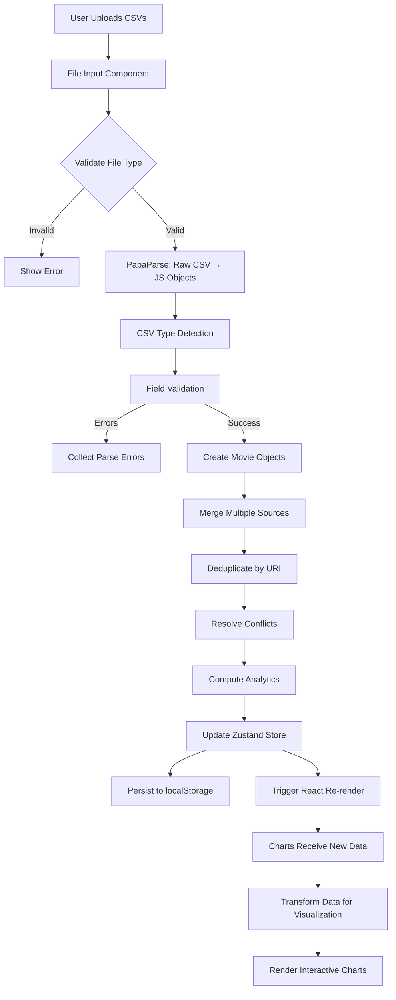

# Architecture

> **Production-grade client-side architecture** for processing and visualizing large datasets without backend infrastructure.

This document explains the technical architecture, design decisions, and engineering patterns that power Letterboxd Stats. It demonstrates real-world frontend engineering: from CSV parsing pipelines to state management at scale.

---

## Table of Contents

1. [System Overview](#system-overview)
2. [Architecture Principles](#architecture-principles)
3. [Data Flow](#data-flow)
4. [Component Architecture](#component-architecture)
5. [State Management](#state-management)
6. [Data Processing Pipeline](#data-processing-pipeline)
7. [Performance Optimizations](#performance-optimizations)
8. [File Structure](#file-structure)
9. [Technology Choices](#technology-choices)

---

## System Overview

Letterboxd Stats is a **100% client-side analytics application** that processes user film data entirely in the browser. There is no backend server, no database, and no API calls for data processing—everything happens on the user's device.

### High-Level Architecture

```
┌─────────────────────────────────────────────────────────────┐
│                        User Browser                         │
├─────────────────────────────────────────────────────────────┤
│                                                             │
│  ┌───────────────┐    ┌──────────────┐    ┌─────────────┐   │
│  │  CSV Upload   │----│ Data Parser  │----│  Zustand    │   │
│  │  (React)      │    │ (PapaParse)  │    │  Store      │   │
│  └───────────────┘    └──────────────┘    └──────┬──────┘   │
│                                                  │          │
│                                                  ▼          │
│  ┌───────────────────────────────────────────────────────┐  │
│  │           Analytics Engine (Pure Functions)           │  │
│  │  • Data Merging      • Aggregation                    │  │
│  │  • Transformations   • Statistics                     │  │
│  └────────────────────────────┬──────────────────────────┘  │
│                               │                             │
│                               ▼                             │
│  ┌───────────────────────────────────────────────────────┐  │
│  │         Chart Components (18+ Visualizations)         │  │
│  │  • Recharts Integration  • Real-time Filtering        │  │
│  │  • Responsive Layouts    • Interactive Tooltips       │  │
│  └───────────────────────────────────────────────────────┘  │
│                                                             │
│  ┌───────────────────────────────────────────────────────┐  │
│  │              localStorage Persistence                 │  │
│  │  • Session State  • Dataset Cache  • User Prefs       │  │
│  └───────────────────────────────────────────────────────┘  │
│                                                             │
└─────────────────────────────────────────────────────────────┘
```

### Why Client-Side?

**Privacy First**
- User data never leaves their device
- No server to store sensitive viewing history
- GDPR compliant by design
- Zero tracking or analytics cookies

**Zero Infrastructure Cost**
- No backend servers to maintain
- No databases to scale
- No API rate limits
- Deployed as static assets on Vercel Edge Network

**Performance Benefits**
- Sub-100ms chart updates (no network latency)
- Works offline after initial load
- Instant processing of 1000+ film records
- No server response time bottlenecks

---

## Architecture Principles

### 1. **Separation of Concerns**

The application is organized into distinct layers with clear responsibilities:

- **Presentation Layer** (`components/`) - React components, UI logic, user interactions
- **State Layer** (`hooks/use-analytics-store.ts`) - Zustand store, persistence, state mutations
- **Business Logic Layer** (`lib/`) - Data processing, analytics computation, transformations
- **Type Layer** (`lib/types.ts`) - TypeScript interfaces defining all data structures

### 2. **Unidirectional Data Flow**

Data flows in one direction through the application:

```
CSV Upload → Parser → Merger → Analytics Engine → Store → Components
```

Components **never** mutate data directly. All mutations happen through store actions, ensuring predictable state updates.

### 3. **Pure Functions for Business Logic**

All data transformations and analytics computations are **pure functions**:
- No side effects (no API calls, no DOM manipulation)
- Deterministic (same input = same output)
- Easily testable (unit tests without mocking)
- Composable (functions combine to build complex logic)

Example from `lib/analytics-transformers.ts`:
```typescript
export function transformRatingDistribution(movies: Movie[]): ChartData[] {
  const rated = movies.filter(m => m.rating !== undefined)
  const distribution = groupBy(rated, m => m.rating!.toFixed(1))

  return Object.entries(distribution)
    .map(([rating, films]) => ({
      rating: parseFloat(rating),
      count: films.length,
      percentage: (films.length / rated.length) * 100
    }))
    .sort((a, b) => b.rating - a.rating)
}
```

### 4. **Type Safety Everywhere**

**Strict TypeScript** with no `any` types in production code:
- Every CSV row has a typed interface
- Every component prop is typed
- Every store action is typed
- Compile-time safety prevents runtime bugs

### 5. **Component Composition Over Inheritance**

Components are composed from smaller, reusable pieces:
- `SectionLayout` wraps charts with consistent spacing/headers
- `ChartPlaceholder` handles loading/empty states
- `Card` from shadcn/ui provides base styling
- Charts receive typed data props and render independently

---

## Data Flow

### Complete Request Flow: Upload to Visualization



### Detailed Flow Steps

#### 1. **CSV Upload** (`components/dialogs/`)
```typescript
// User drops files
onDrop={(files) => uploadFiles(files)}
```

#### 2. **Parsing** (`lib/csv-parser.ts`)
```typescript
export async function parseLetterboxdCSV(file: File): Promise<ParseResult<Movie[]>> {
  // Read file content
  const content = await file.text()

  // Parse with PapaParse
  const parsed = Papa.parse<CSVRow>(content, {
    header: true,
    skipEmptyLines: true,
    transformHeader: (h) => h.trim()
  })

  // Detect CSV type from headers
  const csvType = detectCSVType(parsed.meta.fields)

  // Validate and transform each row
  const movies = parsed.data.map(row => transformRowToMovie(row, csvType))

  return { success: true, data: movies, errors: [] }
}
```

#### 3. **Merging** (`lib/data-merger.ts`)
```typescript
export function mergeMovieSources(
  watched: Movie[],
  diary?: Movie[],
  ratings?: Movie[],
  films?: Movie[],
  watchlist?: Movie[],
  profile?: UserProfile
): MovieDataset {
  // Start with watched.csv as base
  const movieMap = new Map<string, Movie>()
  watched.forEach(m => movieMap.set(getMovieKey(m), m))

  // Merge diary.csv (adds watch dates, rewatches, tags)
  diary?.forEach(m => {
    const key = getMovieKey(m)
    const existing = movieMap.get(key)
    if (existing) {
      movieMap.set(key, resolveConflicts(existing, m, 'diary'))
    }
  })

  // Merge ratings.csv (most current ratings - highest priority)
  ratings?.forEach(m => {
    const key = getMovieKey(m)
    const existing = movieMap.get(key)
    if (existing) {
      movieMap.set(key, resolveConflicts(existing, m, 'ratings'))
    }
  })

  // Merge films.csv (liked flag)
  films?.forEach(m => {
    const key = getMovieKey(m)
    const existing = movieMap.get(key)
    if (existing) {
      existing.liked = true
    }
  })

  return {
    watched: Array.from(movieMap.values()),
    watchlist: watchlist || [],
    userProfile: profile,
    lastUpdated: new Date(),
    uploadedFiles: ['watched', 'diary', 'ratings', 'films'].filter(Boolean)
  }
}
```

#### 4. **Analytics Computation** (`lib/analytics-engine.ts`)
```typescript
export function computeAnalytics(movies: Movie[]): AnalyticsOverview {
  const rated = movies.filter(m => m.rating !== undefined)
  const liked = movies.filter(m => m.liked === true)
  const rewatched = movies.filter(m => m.rewatch === true)

  return {
    totalMoviesWatched: movies.length,
    moviesRated: rated.length,
    moviesLiked: liked.length,
    ratingCoverage: (rated.length / movies.length) * 100,
    likeRatio: (liked.length / movies.length) * 100,
    averageRating: mean(rated.map(m => m.rating!)),
    medianRating: median(rated.map(m => m.rating!)),
    ratingDistribution: groupByRating(rated),
    totalRewatches: sum(rewatched.map(m => m.rewatchCount || 1)),
    moviesRewatched: rewatched.length,
    rewatchRate: (rewatched.length / movies.length) * 100,
    // ... more statistics
  }
}
```

#### 5. **Store Update** (`hooks/use-analytics-store.ts`)
```typescript
uploadFiles: async (files: File[]) => {
  set({ loading: true, error: null })

  // Parse all files
  const [watched, diary, ratings, films, watchlist, profile] =
    await Promise.all(files.map(parseFile))

  // Merge sources
  const dataset = mergeMovieSources(watched, diary, ratings, films, watchlist, profile)

  // Compute analytics
  const analytics = computeAnalytics(dataset.watched)

  // Update state (triggers localStorage persistence)
  set({
    dataset,
    analytics,
    uploadedFiles: files.map(f => f.name),
    lastUpdated: new Date().toISOString(),
    loading: false
  })
}
```

#### 6. **Component Re-render** (`components/analytics/analytics-dashboard.tsx`)
```typescript
export function AnalyticsDashboard() {
  // Subscribe to store
  const dataset = useAnalyticsStore(state => state.dataset)
  const analytics = useAnalyticsStore(state => state.analytics)

  // Transform data for specific chart
  const ratingData = useMemo(() =>
    transformRatingDistribution(dataset.watched),
    [dataset]
  )

  return (
    <RatingDistributionBar data={ratingData} />
  )
}
```

---

## Component Architecture

### Component Hierarchy

```
app/
├── layout.tsx (Root layout, providers, metadata)
├── page.tsx (Landing page)
└── analytics/
    ├── page.tsx (Server component wrapper)
    └── page-client.tsx (Client-side dashboard)
        └── AnalyticsDashboard
            ├── AnalyticsHeader (title, filters, actions)
            ├── StatsOverview (9 summary statistics)
            └── SectionLayout (repeatable chart container)
                ├── RatingDistributionBar
                ├── ViewingTimelineArea
                ├── ReleaseByDecadeBar
                └── ... 15+ more charts
```

### Component Patterns

#### 1. **Server/Client Component Split** (Next.js 16 App Router)

**Server Components** (default):
- `app/layout.tsx` - Metadata, static providers
- `app/page.tsx` - Landing page content
- `app/analytics/page.tsx` - Wrapper that imports client component

**Client Components** (`"use client"`):
- `page-client.tsx` - Interactive dashboard
- Chart components - Recharts requires client-side
- Upload dialogs - File API requires client-side

**Why this matters**: Server components reduce JavaScript sent to browser, improving performance.

#### 2. **Compound Components** (Flexible composition)

Example: `SectionLayout` wraps charts with consistent layout:
```typescript
<SectionLayout title="Rating Distribution" icon={Star}>
  <RatingDistributionBar data={ratingData} />
</SectionLayout>
```

#### 3. **Controlled vs Uncontrolled**

- **Controlled**: Store manages all chart data (single source of truth)
- **Uncontrolled**: UI state like modals, tooltips managed locally with `useState`

#### 4. **Error Boundaries**

```
app/error.tsx - Catches runtime errors
└── Try/Catch blocks in async operations (file upload, parsing)
    └── Graceful error messages shown to user
```

---

## State Management

### Zustand Store Architecture

**Why Zustand over Context API or Redux?**
- ✅ **Minimal boilerplate** - No providers, no actions/reducers
- ✅ **Performance** - Components only re-render when subscribed state changes
- ✅ **Built-in persistence** - localStorage middleware included
- ✅ **TypeScript-friendly** - Full type inference
- ✅ **Small bundle** - ~1KB vs Redux ~15KB

### Store Structure

```typescript
interface AnalyticsStore {
  // ===== PERSISTED STATE (saved to localStorage) =====
  dataset: MovieDataset | null           // All movie data
  analytics: AnalyticsOverview | null    // Computed statistics
  uploadedFiles: string[]                // Filenames uploaded
  lastUpdated: string | null             // ISO timestamp
  isDemoMode: boolean                    // Sample data loaded?

  // ===== TRANSIENT STATE (not persisted) =====
  loading: boolean                       // Upload in progress?
  error: string | null                   // Error message

  // ===== ACTIONS =====
  uploadFiles: (files: File[]) => Promise<void>
  clearData: () => void
  removeFile: (filename: string) => Promise<void>
  hasData: () => boolean
  totalMovies: () => number
}
```

### State Updates

**Immutable Updates:**
```typescript
set({ dataset: newDataset })  // Replaces entire dataset
set(state => ({
  analytics: { ...state.analytics, totalMovies: 100 }
}))
```

**Persistence:**
- Zustand middleware automatically saves to `localStorage` on every `set()` call
- Rehydrates state on page load
- Handles storage quota exceeded (clears old data)

### Subscribing to State

**Full store subscription:**
```typescript
const store = useAnalyticsStore()  // Re-renders on ANY state change
```

**Selective subscription (recommended):**
```typescript
const dataset = useAnalyticsStore(state => state.dataset)  // Only re-renders when dataset changes
const loading = useAnalyticsStore(state => state.loading)  // Only re-renders when loading changes
```

**Outside React components:**
```typescript
const hasData = useAnalyticsStore.getState().hasData()
```

---

## Data Processing Pipeline

### CSV Parsing Pipeline

```
Raw CSV File
    ↓
PapaParse (streaming parser)
    ↓
Header Detection → Identify CSV Type (watched/diary/ratings/films/watchlist/profile)
    ↓
Row Validation → Check required fields, data types
    ↓
Row Transformation → Convert strings to typed objects
    ↓
Movie[] Array (typed, validated)
```

### Merge Strategy

**Conflict Resolution Priority:**

1. **ratings.csv** - Most current ratings (overrides all)
2. **diary.csv** - Watch dates, rewatches, tags (overrides watched.csv)
3. **watched.csv** - Base dataset (lowest priority)
4. **films.csv** - Adds `liked: true` flag

**Example Conflict:**
```typescript
// watched.csv: Movie has rating 4.0
// diary.csv: Movie has rating 4.5
// ratings.csv: Movie has rating 5.0
// Result: 5.0 (ratings.csv wins)
```

### Analytics Computation

**Two-Phase Computation:**

1. **Base Analytics** (`computeAnalytics()`)
   - Runs once after data merge
   - Computes expensive aggregations (totals, averages, distributions)
   - Stored in Zustand store

2. **Chart Transformations** (`lib/analytics-transformers.ts`)
   - Runs on-demand when rendering charts
   - Lightweight transformations (filtering, grouping, sorting)
   - Memoized with `useMemo()` to prevent re-computation

**Performance Optimization:**
```typescript
// Heavy computation (once)
const analytics = computeAnalytics(movies)  // ~50ms for 1000 movies

// Lightweight transformation (per chart, memoized)
const chartData = useMemo(() =>
  transformRatingDistribution(movies),
  [movies]
)  // ~5ms
```

---

## Performance Optimizations

### 1. **Code Splitting**

Next.js automatically splits code by route:
```
/ (home)           →  20KB bundle
/analytics         →  150KB bundle (includes Recharts)
/about             →  15KB bundle
```

### 2. **Lazy Loading**

Charts are imported dynamically when needed:
```typescript
const CanonListsGrid = dynamic(() => import('@/components/charts/progress/CanonListsGrid'))
```

### 3. **Memoization**

Expensive computations are memoized:
```typescript
const ratingData = useMemo(() =>
  transformRatingDistribution(dataset.watched),
  [dataset.watched]  // Only recompute when dataset changes
)
```

### 4. **Zustand Selective Subscriptions**

Components only subscribe to the slice of state they need:
```typescript
// BAD: Re-renders on ANY state change
const store = useAnalyticsStore()

// GOOD: Only re-renders when dataset changes
const dataset = useAnalyticsStore(state => state.dataset)
```

### 5. **Bundle Optimization**

- **Tree-shaking**: Unused code removed during build
- **Minification**: Code compressed (Turbopack)
- **Compression**: Gzip/Brotli at CDN level (Vercel)
- **Result**: ~150KB gzipped (all charts + dependencies)

### 6. **localStorage Optimization**

- Only persist essential state (exclude loading/error flags)
- Monitor storage quota (warn at 80%, clear at 100%)
- Serialize efficiently (JSON.stringify optimizations)

---

## File Structure

```
letterboxd-stats-client/
│
├── app/                                 # Next.js 16 App Router
│   ├── layout.tsx                      # Root layout (metadata, fonts, providers)
│   ├── page.tsx                        # Landing page
│   ├── analytics/
│   │   ├── page.tsx                    # Server wrapper
│   │   └── page-client.tsx             # Client dashboard
│   ├── about/page.tsx
│   ├── guide/page.tsx
│   ├── roadmap/page.tsx
│   ├── contact/page.tsx
│   └── api/sample-data/route.ts        # API endpoint for demo data
│
├── components/
│   ├── analytics/
│   │   ├── analytics-dashboard.tsx     # Main dashboard orchestrator
│   │   ├── analytics-header.tsx        # Title, filters, actions
│   │   ├── stats-overview.tsx          # 9 summary statistics
│   │   ├── favorite-films.tsx          # User's favorite films
│   │   └── SectionLayout.tsx           # Reusable chart container
│   │
│   ├── charts/                         # 18+ chart components
│   │   ├── timeline/                   # Time-based charts
│   │   │   ├── ViewingTimelineArea.tsx
│   │   │   └── YearOverYearArea.tsx
│   │   ├── distribution/               # Distribution charts
│   │   │   ├── RatingDistributionBar.tsx
│   │   │   └── ReleaseYearDistributionBar.tsx
│   │   ├── decades/                    # Decade-based charts
│   │   │   ├── ReleaseByDecadeBar.tsx
│   │   │   └── TopRatedDecadesBar.tsx
│   │   ├── ratios/                     # Radial/gauge charts
│   │   │   ├── RatedRatioRadial.tsx
│   │   │   └── LikedRatioRadial.tsx
│   │   ├── progress/                   # Progress tracking
│   │   │   ├── WatchlistProgressChart.tsx
│   │   │   └── CanonListsGrid.tsx
│   │   └── index.ts                    # Barrel export
│   │
│   ├── dialogs/                        # Modal dialogs
│   │   ├── upload-dialog.tsx
│   │   └── profile-replace-confirm.tsx
│   │
│   ├── layout/                         # Layout components
│   │   ├── header.tsx
│   │   ├── footer.tsx
│   │   └── theme-provider.tsx
│   │
│   └── ui/                             # Base UI components (shadcn/ui)
│       ├── button.tsx
│       ├── card.tsx
│       ├── dialog.tsx
│       └── ... (30+ components)
│
├── hooks/
│   ├── use-analytics-store.ts          # Zustand store
│   ├── use-theme-safe.ts               # Theme management
│   └── use-media-query.ts              # Responsive hooks
│
├── lib/
│   ├── types.ts                        # ALL TypeScript types
│   ├── csv-parser.ts                   # CSV parsing logic
│   ├── data-merger.ts                  # Multi-source merging
│   ├── analytics-engine.ts             # Base analytics computation
│   ├── analytics-transformers.ts       # Chart-specific transformations
│   ├── utils.ts                        # Utility functions
│   └── sample-data.ts                  # Demo datasets
│
├── public/                             # Static assets
│   ├── screenshots/
│   └── sample-data/
│
├── __tests__/                          # Test suites
│   ├── unit/                           # Unit tests (Vitest)
│   └── e2e/                            # End-to-end tests (Playwright)
│
├── styles/
│   └── globals.css                     # Global Tailwind styles
│
├── scripts/
│   └── convert-playlists.ts            # Canon list generation
│
└── Configuration files
    ├── next.config.ts                  # Next.js config
    ├── tailwind.config.ts              # Tailwind config
    ├── tsconfig.json                   # TypeScript config
    ├── vitest.config.ts                # Test config
    └── playwright.config.ts            # E2E test config
```

---

## Technology Choices

### Why Next.js 16 (App Router)?

**Benefits:**
- ✅ **Server/Client Split** - Minimize JavaScript sent to browser
- ✅ **Built-in Routing** - File-based routing, no react-router needed
- ✅ **Image Optimization** - Automatic image resizing/lazy loading
- ✅ **SEO-Friendly** - Server-side rendering for landing pages
- ✅ **API Routes** - Built-in backend for sample data endpoint
- ✅ **Turbopack** - Next-gen bundler (3-4x faster than Webpack)

**Trade-offs:**
- ❌ Learning curve (App Router paradigm shift from Pages Router)
- ❌ Some libraries require `"use client"` directive

### Why TypeScript?

**Benefits:**
- ✅ **Catch bugs at compile time** - Type errors before runtime
- ✅ **Better IDE support** - Autocomplete, inline docs, refactoring
- ✅ **Self-documenting code** - Types explain data structures
- ✅ **Refactoring confidence** - Know exactly what breaks when you change code

**Example:**
```typescript
// TypeScript catches this error at compile time
const movie: Movie = {
  title: "Inception",
  year: "2010"  // ❌ Type 'string' is not assignable to type 'number'
}
```

### Why Zustand over Redux?

**Comparison:**

| Feature | Zustand | Redux Toolkit |
|---------|---------|---------------|
| Bundle Size | ~1KB | ~15KB |
| Boilerplate | Minimal | Moderate |
| TypeScript Support | Excellent | Excellent |
| DevTools | Yes | Yes |
| Middleware | Built-in (persist) | Built-in (thunk, saga) |
| Learning Curve | Low | Moderate |

**Decision:** For client-side app with simple state, Zustand is sufficient. Redux would be overkill.

### Why Recharts?

**Alternatives Considered:**
- **Chart.js** - Not React-native, requires wrapper
- **Victory** - Large bundle size (~100KB)
- **Nivo** - Beautiful but heavy (~150KB)
- **Recharts** - React-native, reasonable bundle (~50KB), good docs

**Decision:** Recharts balances features, bundle size, and React integration.

### Why Tailwind CSS v4?

**Benefits:**
- ✅ **Utility-first** - Compose styles without leaving JSX
- ✅ **Autocomplete** - IntelliSense for class names
- ✅ **Tree-shaking** - Unused styles purged automatically
- ✅ **Dark mode** - Built-in with `dark:` variant
- ✅ **Responsive** - Built-in with `sm:`, `md:`, `lg:` variants

**Trade-offs:**
- ❌ HTML can get verbose (mitigated with component abstraction)

### Why PapaParse?

**Alternatives:**
- **csv-parser** - Node.js only, not browser-compatible
- **d3-dsv** - Requires D3 dependency
- **Manual parsing** - Error-prone, doesn't handle edge cases

**Decision:** PapaParse is battle-tested, handles edge cases (quoted commas, newlines in fields), and works in browser.

---

## Key Takeaways

This architecture demonstrates:

1. **Client-Side at Scale** - Processing 1000+ records without backend
2. **Type Safety** - Strict TypeScript prevents entire classes of bugs
3. **Performance Engineering** - Sub-100ms interactions via memoization, code splitting, selective subscriptions
4. **State Management** - Clean separation between global state (Zustand) and UI state (React hooks)
5. **Pure Functional Logic** - Testable, composable, predictable data transformations
6. **Production Readiness** - Error handling, validation, persistence, monitoring

**This is not a tutorial project—it's production-grade architecture solving real engineering challenges.**

---

## Next Steps

Want to dive deeper?

- **[Performance](./PERFORMANCE.md)** - Detailed performance analysis and optimizations
- **[Data Processing](./DATA_PROCESSING.md)** - CSV parsing and merging internals
- **[Testing Strategy](./TESTING_STRATEGY.md)** - Unit, integration, and E2E testing approach

---

*Last Updated: January 2026*
