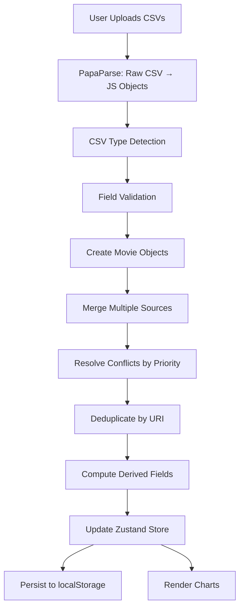

# Data Guide

> **Complete reference for data structures, CSV processing, and data flow** in the Letterboxd Stats application. This guide consolidates information about how movie data is parsed, merged, and used throughout the application.

**Last Updated:** January 2026

---

## Table of Contents

1. [Quick Reference](#quick-reference)
2. [Data Flow Overview](#data-flow-overview)
3. [Core Data Structures](#core-data-structures)
4. [CSV Files & Data Mapping](#csv-files--data-mapping)
5. [Merge Strategy & Conflict Resolution](#merge-strategy--conflict-resolution)
6. [Computed Fields](#computed-fields)
7. [Real-World Examples](#real-world-examples)
8. [Using Data in Code](#using-data-in-code)
9. [Data Validation & Error Handling](#data-validation--error-handling)

---

## Quick Reference

### What You Get with Full Upload

```
User uploads 6 CSV files
        ↓
┌─────────────────────────────────────┐
│ APPLICATION RECEIVES                │
├─────────────────────────────────────┤
│                                     │
│ dataset.watched:                    │
│   ├─ ~1000 movies (merged data)    │
│   ├─ Complete movie info            │
│   ├─ Ratings (if rated)             │
│   ├─ Watch dates (if in diary)      │
│   ├─ Rewatch info (if in diary)     │
│   ├─ Tags (if in diary)             │
│   ├─ Liked flag (if in films.csv)   │
│   └─ Computed: decade, era          │
│                                     │
│ dataset.watchlist:                  │
│   ├─ ~200 unwatched movies          │
│   ├─ No ratings                     │
│   └─ Structured like watched movies │
│                                     │
│ dataset.userProfile:                │
│   ├─ Username, name, location       │
│   ├─ Join date                      │
│   └─ 0-4 favorite films             │
│                                     │
│ dataset.uploadedFiles:              │
│   └─ ['watched', 'diary',           │
│       'ratings', 'films',           │
│       'watchlist', 'profile']       │
│                                     │
└─────────────────────────────────────┘
```

### File Priority Hierarchy

```
              RATING PRIORITY
                    ↓
        ratings.csv (ALWAYS WINS)
                    ↓
        diary.csv (if no ratings.csv)
                    ↓
        watched.csv (if no ratings/diary)


      WATCHED DATE PRIORITY
                    ↓
        diary.csv (ALWAYS WINS)
                    ↓
        watched.csv (fallback)


      TAGS PRIORITY
                    ↓
        diary.csv (ONLY SOURCE)


      LIKED FLAG PRIORITY
                    ↓
        films.csv (ONLY SOURCE)
```

### Minimum vs Complete Data

| Upload Type | Files | Capabilities |
|-------------|-------|--------------|
| **Minimum** | `watched.csv` only | Basic movie list, title, year, dateMarkedWatched. Limited analytics. |
| **Recommended** | All 6 files | Complete analytics with ratings, watch dates, tags, likes, watchlist, profile. |

---

## Data Flow Overview

### Complete Request Flow



### Key Processing Steps

1. **CSV Upload** - User selects 1-6 CSV files
2. **Parsing** - PapaParse converts CSV → JavaScript objects
3. **Type Detection** - Identify which CSV type (watched, diary, etc.)
4. **Validation** - Check required fields, data types
5. **Transformation** - Convert strings to typed objects (Date, number, etc.)
6. **Merging** - Combine data from multiple sources
7. **Conflict Resolution** - Apply priority rules
8. **Deduplication** - Remove duplicate movies (by Letterboxd URI)
9. **Computation** - Calculate decade, era, rewatch counts
10. **Storage** - Save to Zustand store + localStorage

---

## Core Data Structures

### Movie Interface

The primary data structure for a watched movie:

```typescript
interface Movie {
  // Core identifiers
  id: string;              // Letterboxd URI (https://boxd.it/XXX)
  title: string;           // Movie title
  year: number;            // Release year

  // Viewing information
  watchedDate?: Date;      // First time watched (from diary if available)
  dateMarkedWatched: Date; // Date added to watched list (from watched.csv)

  // Rating information
  rating?: number;         // 0.5-5.0 scale (from ratings.csv > diary.csv)
  ratingDate?: Date;       // When rating was made

  // Rewatch information
  rewatch: boolean;        // true if watched multiple times
  rewatchCount?: number;   // Number of times rewatched
  rewatchDates?: Date[];   // Dates of all rewatches

  // Enrichment
  tags?: string[];         // User tags from diary
  liked?: boolean;         // true if in films.csv

  // Computed fields (calculated by application)
  decade: number;          // 1990, 2000, 2010, etc.
  era: 'classic' | 'golden' | 'modern' | 'contemporary';
}
```

### MovieDataset Interface

Container for all user data:

```typescript
interface MovieDataset {
  watched: Movie[];        // All watched movies (primary dataset)
  watchlist: Movie[];      // Unwatched movies (if watchlist.csv uploaded)
  userProfile?: UserProfile; // User profile data (if profile.csv uploaded)
  lastUpdated: Date;       // When dataset was last updated
  uploadedFiles: string[]; // Which CSVs were uploaded
}
```

### UserProfile Interface

User account information:

```typescript
interface UserProfile {
  username: string;            // Letterboxd username
  givenName?: string;          // First name
  familyName?: string;         // Last name
  email?: string;              // Email address
  location?: string;           // Location
  website?: string;            // Personal website
  bio?: string;                // User bio
  pronoun?: string;            // Preferred pronoun
  dateJoined: Date;            // Account creation date
  favoriteFilms: string[];     // Array of Letterboxd URIs (0-4 films)
}
```

---

## CSV Files & Data Mapping

### 1. watched.csv (REQUIRED)

**Purpose:** Base list of all watched movies
**Columns:** Date, Name, Year, Letterboxd URI
**Output:** Creates base `Movie` objects with minimum fields
**Priority:** Lowest (overridden by diary.csv and ratings.csv)

**Example Row:**
```csv
Date,Name,Year,Letterboxd URI
2024-11-15,The Shawshank Redemption,1994,https://boxd.it/2aT2
```

**Fields Populated:**
- `id` = Letterboxd URI
- `title` = Name
- `year` = Year
- `dateMarkedWatched` = Date
- `decade`, `era` = Computed from year

**When to Use:** **ALWAYS**. This is the only required CSV file.

---

### 2. diary.csv (OPTIONAL - Recommended)

**Purpose:** Detailed watching history with dates, ratings, tags, rewatches
**Columns:** Date, Name, Year, Letterboxd URI, Rating, Rewatch, Tags, Watched Date
**Priority:** Medium (overrides watched.csv, overridden by ratings.csv for ratings)

**Example Row:**
```csv
Date,Name,Year,Letterboxd URI,Rating,Rewatch,Tags,Watched Date
2024-11-15,Inception,2010,https://boxd.it/1234,4.5,Yes,"sci-fi, mind-bending",2024-11-14
```

**Fields Populated/Updated:**
- `watchedDate` = Watched Date (HIGHEST PRIORITY for watch dates)
- `rating` = Rating (if not in ratings.csv)
- `ratingDate` = Date
- `rewatch` = Rewatch (Yes/No → boolean)
- `rewatchCount` = Aggregated from multiple entries
- `rewatchDates` = Array of rewatch dates
- `tags` = Tags (comma-separated → array)

**When to Use:** For accurate watch dates, rewatches, and tags. This is the most detailed CSV.

**Rewatch Detection:** If same movie appears multiple times in diary.csv, it's detected as a rewatch. First entry = initial watch, subsequent = rewatches.

---

### 3. ratings.csv (OPTIONAL - Latest Ratings)

**Purpose:** Most current ratings (highest priority)
**Columns:** Date, Name, Year, Letterboxd URI, Rating
**Priority:** **HIGHEST** (always wins for ratings)

**Example Row:**
```csv
Date,Name,Year,Letterboxd URI,Rating
2024-12-01,The Godfather,1972,https://boxd.it/5678,5.0
```

**Fields Populated/Updated:**
- `rating` = Rating (**OVERRIDES** diary.csv and watched.csv)
- `ratingDate` = Date

**When to Use:** User has rated movies since exporting diary.csv. Ratings.csv contains the **most recent** ratings and should always be uploaded if available.

**Conflict Example:**
```
watched.csv:  Rating = 4.0 (old)
diary.csv:    Rating = 4.5 (recent)
ratings.csv:  Rating = 5.0 (most recent)
Result:       Rating = 5.0 ✅ (ratings.csv wins)
```

---

### 4. films.csv (OPTIONAL - Favorites)

**Purpose:** Movies marked as "liked" (favorites)
**Columns:** Date, Name, Year, Letterboxd URI
**Priority:** Only source for `liked` flag

**Example Row:**
```csv
Date,Name,Year,Letterboxd URI
2024-10-20,Pulp Fiction,1994,https://boxd.it/9abc
```

**Fields Populated/Updated:**
- `liked` = `true` (if movie exists in watched.csv)

**When to Use:** Track which movies are user favorites. Liked movies get special visual treatment in charts.

**Note:** If movie is in films.csv but NOT in watched.csv, it's ignored (can't like what you haven't watched).

---

### 5. watchlist.csv (OPTIONAL - To Watch)

**Purpose:** Movies on user's watchlist (not yet watched)
**Columns:** Date, Name, Year, Letterboxd URI
**Storage:** **Separate array** (`dataset.watchlist`), NOT merged with watched movies

**Example Row:**
```csv
Date,Name,Year,Letterboxd URI
2024-11-20,Parasite,2019,https://boxd.it/def1
```

**Fields Populated:**
- Same structure as `Movie` but:
  - No `rating` (unwatched)
  - No `watchedDate` (unwatched)
  - No `rewatch` (unwatched)
  - No `tags` (can't tag unwatched)
  - `dateMarkedWatched` = Date added to watchlist

**When to Use:** Track what user wants to watch. Enables charts like "Watchlist Progress", "Watchlist by Decade".

**Use Cases:**
- "I have 200 movies to watch"
- "Unwatched movies by decade"
- "Watchlist by era"
- "Average year of unwatched movies"

---

### 6. profile.csv (OPTIONAL - User Metadata)

**Purpose:** User account information
**Columns:** Date Joined, Username, Given Name, Family Name, Email, Location, Website, Bio, Pronoun, Favorite Films
**Output:** Single `UserProfile` object

**Example Row:**
```csv
Date Joined,Username,Given Name,Family Name,Email,Location,Website,Bio,Pronoun,Favorite Films
2018-05-10,mariacinephile,Maria,Smith,maria@example.com,"New York, NY",https://maria.com,"Film enthusiast",She/Her,"https://boxd.it/2aT2, https://boxd.it/5678"
```

**Fields Populated:**
- All fields map directly to `UserProfile` interface
- `favoriteFilms` = Comma-separated URIs → array

**When to Use:** Display user info, show favorite films in dashboard.

---

## Merge Strategy & Conflict Resolution

### Merge Priority Rules

When same movie appears in multiple CSV files:

#### For Ratings:
```
ratings.csv (WINS) > diary.csv > watched.csv
```

**Example:**
```typescript
// watched.csv:  rating = 4.0
// diary.csv:    rating = 4.5
// ratings.csv:  rating = 5.0
// Result:       movie.rating = 5.0 ✅
```

#### For Watched Dates:
```
diary.csv (WINS) > watched.csv
```

**Example:**
```typescript
// watched.csv:    dateMarkedWatched = 2024-11-15 (when added to watched list)
// diary.csv:      watchedDate = 2024-11-14 (actual watch date)
// Result:         movie.watchedDate = 2024-11-14 ✅ (more accurate)
//                 movie.dateMarkedWatched = 2024-11-15 (both preserved)
```

#### For Tags:
```
diary.csv (ONLY SOURCE)
```

**Example:**
```typescript
// Only diary.csv contains tags
// Result: movie.tags = ["sci-fi", "mind-bending"]
```

#### For Liked Flag:
```
films.csv (ONLY SOURCE)
```

**Example:**
```typescript
// If movie exists in films.csv
// Result: movie.liked = true
```

### Deduplication

Movies are deduplicated by **Letterboxd URI** (unique identifier):

```typescript
function getMovieKey(movie: Movie): string {
  return movie.id; // Letterboxd URI
}

// Only one Movie object per unique URI
const movieMap = new Map<string, Movie>();
```

**Example:**
```typescript
// Same movie in 3 files:
watched.csv:  {id: "https://boxd.it/2aT2", title: "Shawshank", rating: 4.0}
diary.csv:    {id: "https://boxd.it/2aT2", title: "Shawshank Redemption", rating: 4.5, tags: ["classic"]}
ratings.csv:  {id: "https://boxd.it/2aT2", title: "Shawshank", rating: 5.0}

// Result (merged):
{
  id: "https://boxd.it/2aT2",
  title: "The Shawshank Redemption", // From diary.csv (most complete)
  rating: 5.0,                        // From ratings.csv (highest priority)
  tags: ["classic"]                   // From diary.csv (only source)
}
```

---

## Computed Fields

After merging, the application computes additional fields:

### Decade Calculation

```typescript
function computeDecade(year: number): number {
  return Math.floor(year / 10) * 10;
}

// Examples:
// 2024 → 2020 (2020s)
// 1999 → 1990 (1990s)
// 1985 → 1980 (1980s)
// 1944 → 1940 (1940s)
```

### Era Classification

```typescript
type Era = 'classic' | 'golden' | 'modern' | 'contemporary';

function computeEra(year: number): Era {
  if (year <= 1944) return 'classic';      // Silent era and early talkies
  if (year <= 1969) return 'golden';       // Golden Age of Hollywood
  if (year <= 1999) return 'modern';       // New Hollywood and blockbusters
  return 'contemporary';                   // Digital era and modern cinema
}

// Era Definitions:
// Classic (≤1944):        1900–1944
// Golden (1945-1969):     1945–1969
// Modern (1970-1999):     1970–1999
// Contemporary (≥2000):   2000–Present
```

### Rewatch Count Aggregation

From diary.csv, multiple entries for same movie = rewatches:

```typescript
// diary.csv entries:
// 2024-11-14, Inception, ...  (first watch)
// 2024-12-20, Inception, ...  (rewatch)
// 2025-01-05, Inception, ...  (rewatch)

// Result:
{
  title: "Inception",
  rewatch: true,
  rewatchCount: 2,           // Number of rewatches (not including first)
  rewatchDates: [
    new Date("2024-12-20"),
    new Date("2025-01-05")
  ],
  watchedDate: new Date("2024-11-14") // First watch
}
```

---

## Real-World Examples

### Example: Maria's Upload

**User:** Maria
**Letterboxd Username:** mariacinephile
**Join Date:** May 10, 2018

**Files Uploaded:**

1. **watched.csv** (1,234 movies)
   - All movies ever marked as watched
   - Basic info: title, year, dateMarkedWatched

2. **diary.csv** (534 entries)
   - Detailed entries (subset of watched)
   - Includes accurate watch dates, some ratings, tags
   - Some movies have multiple entries (rewatches)

3. **ratings.csv** (892 ratings)
   - Latest ratings (includes updates after diary)
   - Highest priority for rating values

4. **films.csv** (156 likes)
   - Favorite movies

5. **watchlist.csv** (287 movies)
   - Movies Maria wants to watch

6. **profile.csv**
   - Maria Smith, NYC, 4 favorite films

### Result After Processing:

```
dataset.watched: 1,234 movies
├─ 892 have ratings (from ratings.csv)
├─ 534 have accurate watch dates (from diary.csv)
├─ 534 have tags (from diary.csv)
├─ Some have rewatch info (from diary.csv duplicates)
└─ 156 marked as liked (from films.csv)

dataset.watchlist: 287 movies
└─ Awaiting watch

dataset.userProfile:
├─ mariacinephile
├─ Maria Smith
├─ NYC, joined May 10, 2018
└─ 4 favorite films
```

### Example Merged Movie:

**The Shawshank Redemption (1994)**

```typescript
{
  // From all sources (merged):
  id: "https://boxd.it/2aT2",
  title: "The Shawshank Redemption",
  year: 1994,

  // From watched.csv:
  dateMarkedWatched: new Date("2024-11-15"),

  // From diary.csv:
  watchedDate: new Date("2024-11-14"),
  tags: ["classic", "drama"],

  // From ratings.csv (overrides diary):
  rating: 5.0,
  ratingDate: new Date("2024-12-01"),

  // From films.csv:
  liked: true,

  // Computed:
  decade: 1990,
  era: "modern",
  rewatch: false
}
```

---

## Using Data in Code

### Accessing Data

```typescript
// In a React component:
import { useAnalyticsStore } from "@/hooks/use-analytics-store"

function MyComponent() {
  // Access store
  const { dataset, analytics } = useAnalyticsStore();

  // Check what was uploaded
  const hasWatchlist = dataset?.uploadedFiles.includes('watchlist');
  const hasProfile = dataset?.uploadedFiles.includes('profile');

  // Get all watched movies
  const allWatched = dataset?.watched || [];

  // Get watchlist (if uploaded)
  const watchlist = hasWatchlist ? dataset.watchlist : [];

  // Get user profile (if uploaded)
  const username = dataset?.userProfile?.username;

  return (
    <div>
      {/* Render data */}
    </div>
  );
}
```

### Filtering Data

```typescript
// Filter by specific criteria
const liked = allWatched.filter(m => m.liked);
const rated = allWatched.filter(m => m.rating !== undefined);
const rewatched = allWatched.filter(m => m.rewatch);
const modernFilms = allWatched.filter(m => m.era === 'modern');

// Filter by rating range
const highlyRated = allWatched.filter(m =>
  m.rating !== undefined && m.rating >= 4.5
);

// Filter by decade
const nineties = allWatched.filter(m => m.decade === 1990);

// Filter by tags
const sciFi = allWatched.filter(m =>
  m.tags?.includes('sci-fi')
);
```

### Grouping Data

```typescript
import { groupBy } from "@/lib/utils"

// Group by era
const byEra = groupBy(allWatched, m => m.era);
// Result: { classic: [...], golden: [...], modern: [...], contemporary: [...] }

// Group by decade
const byDecade = groupBy(allWatched, m => m.decade);
// Result: { 1980: [...], 1990: [...], 2000: [...], ... }

// Group by rating
const byRating = groupBy(
  allWatched.filter(m => m.rating !== undefined),
  m => m.rating!.toFixed(1)
);
// Result: { "4.0": [...], "4.5": [...], "5.0": [...] }
```

### Calculating Statistics

```typescript
// Calculate average rating
const ratedMovies = allWatched.filter(m => m.rating !== undefined);
const averageRating = ratedMovies.reduce((sum, m) => sum + (m.rating || 0), 0) / ratedMovies.length;

// Count by criteria
const totalLiked = allWatched.filter(m => m.liked).length;
const totalRewatched = allWatched.filter(m => m.rewatch).length;

// Find most common decade
const decadeCounts = Object.entries(
  groupBy(allWatched, m => m.decade)
).map(([decade, movies]) => ({
  decade,
  count: movies.length
})).sort((a, b) => b.count - a.count);

const mostCommonDecade = decadeCounts[0];
```

---

## Data Validation & Error Handling

### CSV Parsing Errors

The application handles various error cases:

1. **Invalid CSV Format**
   - Missing required columns
   - Malformed CSV structure
   - → Error: "Invalid CSV format. Missing required columns: [columns]"

2. **Invalid Data Types**
   - Year not a number
   - Rating outside 0.5-5.0 range
   - → Error: "Invalid data in row X: [details]"

3. **Missing Required Fields**
   - Movie without title or year
   - → Row skipped, warning logged

4. **Date Parsing Errors**
   - Invalid date format
   - → Fallback to `new Date()` or skip field

### Data Quality Checks

After merging:

```typescript
// Check data quality
const stats = {
  totalMovies: dataset.watched.length,
  moviesWithRatings: dataset.watched.filter(m => m.rating).length,
  moviesWithWatchDates: dataset.watched.filter(m => m.watchedDate).length,
  moviesWithTags: dataset.watched.filter(m => m.tags?.length).length,
  moviesLiked: dataset.watched.filter(m => m.liked).length,
};

// Warning if low data quality
if (stats.moviesWithRatings / stats.totalMovies < 0.5) {
  console.warn("Less than 50% of movies have ratings. Consider uploading ratings.csv");
}
```

### Edge Cases Handled

1. **Duplicate Movies** - Deduplicated by Letterboxd URI
2. **Movies in watchlist AND watched** - Removed from watchlist
3. **Invalid years** - Filtered out (must be 1888-current year)
4. **Missing Letterboxd URI** - Movie skipped (required for deduplication)
5. **Empty CSVs** - Handled gracefully, empty array returned

---

## Summary

### Minimum Upload (Just watched.csv)

```
✅ Basic movie list
✅ Title, year, dateMarkedWatched
✅ Computed decade, era
❌ No ratings
❌ No accurate watch dates
❌ No tags
❌ No rewatch info
```

### Recommended Upload (All 6 Files)

```
✅ Complete movie library
✅ Ratings (latest from ratings.csv)
✅ Accurate watch dates (from diary.csv)
✅ Tags (from diary.csv)
✅ Rewatch info (from diary.csv)
✅ Liked movies (from films.csv)
✅ Watchlist (from watchlist.csv)
✅ User profile (from profile.csv)
✅ Full analytics capabilities
```

### Key Takeaways

1. **File Priority:** `ratings.csv > diary.csv > watched.csv`
2. **Storage:** Browser localStorage (no server backup)
3. **Updates:** Re-upload files when data changes
4. **Privacy:** User controls all data (100% client-side)
5. **Deduplication:** By Letterboxd URI (unique identifier)
6. **Computed Fields:** Decade and era calculated automatically
7. **Rewatch Detection:** Multiple diary entries = rewatches

---

## Related Documentation

- **[ARCHITECTURE.md](./ARCHITECTURE.md)** - Overall system architecture and data flow
- **[CHARTS_CATALOG.md](./CHARTS_CATALOG.md)** - How charts consume this data
- **[VISUALIZATION_PHILOSOPHY.md](./VISUALIZATION_PHILOSOPHY.md)** - How data is visualized

---

*Last Updated: January 2026*
*Maintained by: Maria Holly*
